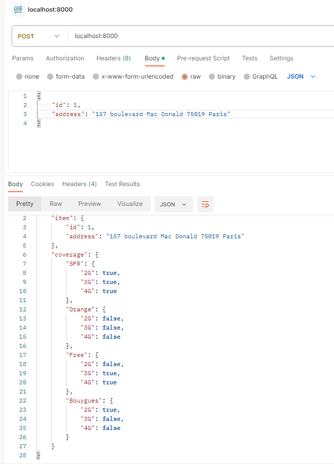

# Implementation of the solution

This presents the solution to get the city network coverage.

## Requirements
Make sure you have theses installed :
- python (>3.10)
-  pip

1. Create a python env
```bash
python -m venv <name_of_env>
```

2. Install the requirements
```bash
pip install requirements.txt
```

3. New column is created to get the addresses from the x,y of the csv file

A new column is created to have addresses from the X,Y of the input CSV file. This column is created via the [luigi](https://github.com/spotify/luigi) luigi librairy.

This librairy handles multi threads, so it's conveniant to use it to handle the multiple lines of the CSV file.

The new file generated is called **results_address.csv**.

4. Get the results

To have the results of the coverage of the input cities, you shoud do the following :
```bash
cd papernest

uvicorn get_api:app --reload
```

5. Test the api

In Postman for example, call the api with query like in the following image : 



We shoud get the expected results like showed in the image.


5. Launch test

To launch unit tests, add the following command :

```bash
py -m unittest test\test_api_functions.py
```